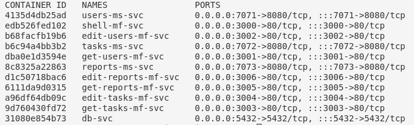
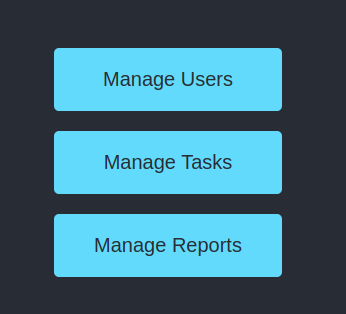

**Magic Travels** es una innovadora plataforma de gestión de viajes que ofrece experiencias personalizadas. Utilizando IA y análisis de datos, optimiza la planificación, reserva y gestión de viajes. Con opciones de transporte, alojamiento y actividades, brinda itinerarios optimizados, asistencia en tiempo real y reseñas de usuarios para una experiencia de viaje sin contratiempos.

### Documentación

La presente prueba técnica está documentada en el link que se dota a continuación, en la documentación se específica el proceso de análisis, planeación, diseño y se responde a las preguntas señaladas en la historia de usuario de la prueba:

[Documentación de la prueba (click me)](https://fjroldan.github.io/magic-travels/ "Clic")

### Estructura

Se opto por una estrategia de monorepositorio, a continuación se describe la estructura:

```
├── design
│   ├── analysis
│   │   └── conceptual_map.drawio.png  # Mapa conceptual de análisis, creado con Draw.io.
│   └── architecture
│       ├── arch.drawio.png             # Diagrama de arquitectura, creado con Draw.io.
│       └── arch-prop.drawio.png        # Diagrama de arquitectura con propiedades, creado con Draw.io.
├── docs
│   ├── analysis.md                     # Documento en Markdown que describe el análisis.
│   ├── desing.md                       # Documento en Markdown que describe el diseño.
│   ├── image
│   │   ├── analysis
│   │   │   └── 1722002867249.png       # Imagen relacionada con el análisis.
│   │   └── desing
│   │       ├── 1722013312996.png       # Imagen relacionada con el diseño.
│   │       └── 1722013379386.png       # Otra imagen relacionada con el diseño.
│   └── index.md                        # Documento en Markdown que probablemente sirve como índice o resumen.
├── .gitignore                          # Archivo que especifica qué archivos o directorios deben ser ignorados por Git.
├── README.md                           # Documento principal de información sobre el proyecto.
└── src
    ├── admin-shell
    │   ├── craco.config.js             # Configuración de Craco para ajustar Webpack en la aplicación.
    │   ├── Dockerfile                   # Archivo de configuración para construir la imagen Docker de admin-shell.
    │   ├── package.json                 # Archivo de configuración de dependencias y scripts de NPM para admin-shell.
    │   ├── package-lock.json            # Archivo que bloquea las versiones exactas de las dependencias de NPM.
    │   ├── public
    │   │   ├── favicon.ico              # Icono de favicon para la aplicación.
    │   │   ├── index.html               # Archivo HTML principal para la aplicación.
    │   │   ├── logo192.png              # Imagen de logo en resolución 192x192.
    │   │   ├── logo512.png              # Imagen de logo en resolución 512x512.
    │   │   ├── manifest.json            # Archivo de manifiesto para la aplicación web.
    │   │   └── robots.txt               # Archivo que indica a los motores de búsqueda qué páginas rastrear.
    │   ├── README.md                    # Documento con información específica sobre admin-shell.
    │   └── src
    │       ├── App.css                  # Hoja de estilos CSS para el componente principal de la aplicación.
    │       ├── App.js                   # Componente principal de la aplicación en React.
    │       ├── App.test.js              # Pruebas para el componente App en React.
    │       ├── bootstrap.js             # Script de arranque para la aplicación.
    │       ├── index.css                # Hoja de estilos CSS globales.
    │       ├── index.js                 # Punto de entrada de la aplicación en React.
    │       ├── logo.svg                 # Imagen de logo en formato SVG.
    │       ├── modules                  # Carpeta con módulos de la aplicación.
    │       │   ├── EditReports.css      # Estilos CSS para el módulo EditReports.
    │       │   ├── EditReports.js       # Componente EditReports en React.
    │       │   ├── EditTasks.css        # Estilos CSS para el módulo EditTasks.
    │       │   ├── EditTasks.js         # Componente EditTasks en React.
    │       │   ├── EditUsers.css        # Estilos CSS para el módulo EditUsers.
    │       │   ├── EditUsers.js         # Componente EditUsers en React.
    │       │   ├── ErrorBoundary.js     # Componente para manejar errores en React.
    │       │   ├── GetReports.css       # Estilos CSS para el módulo GetReports.
    │       │   ├── GetReports.js        # Componente GetReports en React.
    │       │   ├── GetTasks.css         # Estilos CSS para el módulo GetTasks.
    │       │   ├── GetTasks.js          # Componente GetTasks en React.
    │       │   ├── GetUsers.css         # Estilos CSS para el módulo GetUsers.
    │       │   └── GetUsers.js          # Componente GetUsers en React.
    │       ├── reportWebVitals.js       # Script para medir el rendimiento de la aplicación.
    │       └── setupTests.js            # Configuración para pruebas en React.
    ├── app-compose.yml                  # Archivo de configuración de Docker Compose para la aplicación.
    ├── app-deploy.sh                    # Script para desplegar la aplicación.
    ├── back-compose.yml                 # Archivo de configuración de Docker Compose para el backend.
    ├── back-deploy.sh                   # Script para desplegar el backend.
    ├── database-ms
    │   ├── db_setup.sh                 # Script para configurar la base de datos.
    │   └── Dockerfile                   # Archivo de configuración para construir la imagen Docker de la base de datos.
    ├── db-compose.yml                   # Archivo de configuración de Docker Compose para la base de datos.
    ├── db-deploy.sh                     # Script para desplegar la base de datos.
    ├── edit-reports-mf
    │   ├── ...
    ├── edit-tasks-mf
    │   ├── ...
    ├── edit-users-mf
    │   ├── angular.json                # Archivo de configuración de Angular para el microfrontend EditUsers.
    │   ├── Dockerfile                   # Archivo de configuración para construir la imagen Docker del microfrontend EditUsers.
    │   ├── karma.conf.js               # Configuración de Karma para pruebas en Angular.
    │   ├── package.json                 # Archivo de configuración de dependencias y scripts de NPM para el microfrontend EditUsers.
    │   ├── package-lock.json            # Archivo que bloquea las versiones exactas de las dependencias de NPM.
    │   ├── README.md                    # Documento con información específica sobre el microfrontend EditUsers.
    │   ├── src
    │   │   ├── app
    │   │   │   ├── app.component.html  # Plantilla HTML del componente principal de Angular.
    │   │   │   ├── app.component.scss  # Estilos SCSS del componente principal de Angular.
    │   │   │   ├── app.component.spec.ts # Pruebas para el componente principal de Angular.
    │   │   │   ├── app.component.ts    # Componente principal de Angular.
    │   │   │   ├── app.module.ts       # Módulo principal de Angular.
    │   │   │   ├── user.service.ts      # Servicio para manejar usuarios en Angular.
    │   │   │   └── user.ts              # Interfaz o clase para usuarios en Angular.
    │   │   ├── assets
    │   │   │   └── logo.png             # Imagen de logo para el microfrontend.
    │   │   ├── bootstrap.ts             # Script para inicializar la aplicación Angular.
    │   │   ├── environments
    │   │   │   ├── environment.prod.ts  # Configuración de entorno para producción.
    │   │   │   └── environment.ts       # Configuración de entorno para desarrollo.
    │   │   ├── favicon.ico              # Icono de favicon para el microfrontend.
    │   │   ├── index.html               # Archivo HTML principal para el microfrontend.
    │   │   ├── loadApp.ts               # Script para cargar la aplicación Angular.
    │   │   ├── main.ts                 # Punto de entrada de la aplicación Angular.
    │   │   ├── polyfills.ts             # Scripts de polyfills para compatibilidad.
    │   │   ├── styles.scss              # Hoja de estilos SCSS globales.
    │   │   └── test.ts                  # Archivos de prueba para el microfrontend.
    │   ├── tsconfig.app.json            # Configuración de TypeScript para la aplicación Angular.
    │   ├── tsconfig.json                # Configuración global de TypeScript.
    │   ├── tsconfig.spec.json           # Configuración de TypeScript para pruebas.
    │   ├── webpack.config.js            # Configuración de Webpack para el microfrontend.
    │   └── webpack.prod.config.js       # Configuración de Webpack para la producción.
    ├── get-reports-mf
    │   ├── ...
    ├── get-tasks-mf
    │   ├── ...
    ├── home-mf
    │   ├── angular.json                # Archivo de configuración de Angular para el microfrontend Home.
    │   ├── Dockerfile                   # Archivo de configuración para construir la imagen Docker del microfrontend Home.
    │   ├── karma.conf.js               # Configuración de Karma para pruebas en Angular.
    │   ├── package.json                 # Archivo de configuración de dependencias y scripts de NPM para el microfrontend Home.
    │   ├── package-lock.json            # Archivo que bloquea las versiones exactas de las dependencias de NPM.
    │   ├── README.md                    # Documento con información específica sobre el microfrontend Home.
    │   ├── src
    │   │   ├── app
    │   │   │   ├── app.component.html  # Plantilla HTML del componente principal de Angular.
    │   │   │   ├── app.component.scss  # Estilos SCSS del componente principal de Angular.
    │   │   │   ├── app.component.spec.ts # Pruebas para el componente principal de Angular.
    │   │   │   ├── app.component.ts    # Componente principal de Angular.
    │   │   │   ├── app.module.ts       # Módulo principal de Angular.
    │   │   │   └── home.service.ts      # Servicio para manejar la lógica de la página de inicio en Angular.
    │   │   ├── assets
    │   │   │   └── logo.png             # Imagen de logo para el microfrontend.
    │   │   ├── bootstrap.ts             # Script para inicializar la aplicación Angular.
    │   │   ├── environments
    │   │   │   ├── environment.prod.ts  # Configuración de entorno para producción.
    │   │   │   └── environment.ts       # Configuración de entorno para desarrollo.
    │   │   ├── favicon.ico              # Icono de favicon para el microfrontend.
    │   │   ├── index.html               # Archivo HTML principal para el microfrontend.
    │   │   ├── loadApp.ts               # Script para cargar la aplicación Angular.
    │   │   ├── main.ts                 # Punto de entrada de la aplicación Angular.
    │   │   ├── polyfills.ts             # Scripts de polyfills para compatibilidad.
    │   │   ├── styles.scss              # Hoja de estilos SCSS globales.
    │   │   └── test.ts                  # Archivos de prueba para el microfrontend.
    │   ├── tsconfig.app.json            # Configuración de TypeScript para la aplicación Angular.
    │   ├── tsconfig.json                # Configuración global de TypeScript.
    │   ├── tsconfig.spec.json           # Configuración de TypeScript para pruebas.
    │   ├── webpack.config.js            # Configuración de Webpack para el microfrontend.
    │   └── webpack.prod.config.js       # Configuración de Webpack para la producción.
    └── ...

```

### Despligue

La solución se implemento usando docker, para el despliegue se debe seguir los siguientes pasos:

1. Diligenciar el archivo .evn (Se da un ejemplo en la raiz del proyecto example_env.txt).
2. Ejecutar: `bash db-deploy.sh`
3. Ejecutar: `bash app-deploy.sh`
4. Abrir el Navegador en: `http://localhost:3000/`

Se espera a nivel de Docker:



Se espera a nivel de APP:



Gracias.