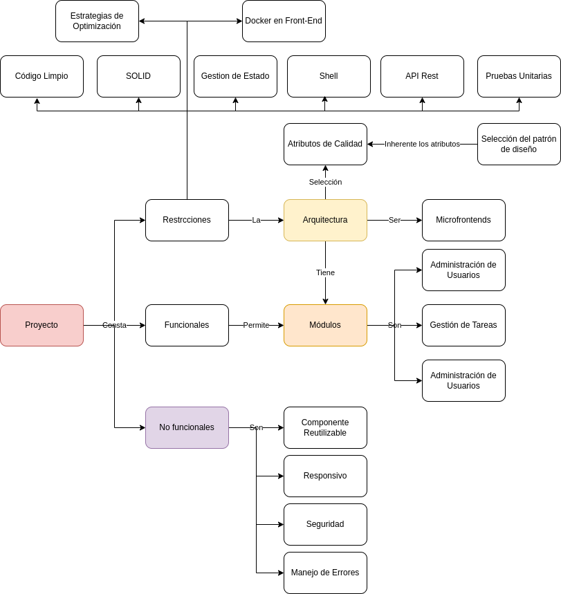

## Análisis

Este proyecto se rige por un conjunto de restricciones y requerimientos cuidadosamente definidos para garantizar su éxito y eficiencia. Las **restricciones del proyecto** abarcan desde la implementación de **estrategias de optimización** para mejorar el rendimiento, hasta la utilización de **Docker en el front-end** para asegurar consistencia en los entornos de desarrollo. La adherencia a principios como **código limpio** y **SOLID** asegura que el código sea mantenible y robusto. Además, se pone énfasis en la **gestión de estado** y habilidades en **shell scripting** para mejorar la eficiencia del flujo de trabajo.

En cuanto a los  **requerimientos funcionales** , se destaca la importancia de una buena  **arquitectura** , la división en  **módulos** , y el uso de **microfrontends** para mejorar la escalabilidad. La **administración de usuarios** y la **gestión de tareas** son funcionalidades clave para la interacción segura y eficiente de los usuarios.

Finalmente, los **requerimientos no funcionales** aseguran la reutilización de componentes, la capacidad de respuesta en diversos dispositivos, la seguridad robusta, y el manejo eficiente de errores. Estos elementos son esenciales para desarrollar un sistema que cumpla con los objetivos del cliente y ofrezca una experiencia de usuario óptima.

A continuación, se presenta el detalle de análisis adelantado, iniciando con el modelado del problema con un diagrama conceptual, identificación de las restricciones, diferentes tipos de requerimientos del sistema y finalizando con la especificación del catálogo de historias de usario identificados.

### Modelado

En el siguiente diagrama se puede apreciar el mapa conceptual adelantado, el cual permite identificar las características requeridas para el proyecto y sus respectivas relaciones:

### Restricciones del Proyecto

A continuación, se describen las restricciones identificadas:

1. **Estrategias de Optimización**:
   Las estrategias de optimización son fundamentales para asegurar que el proyecto funcione eficientemente. Esto puede incluir técnicas para mejorar la velocidad de carga, reducir el uso de recursos y mejorar la capacidad de respuesta del sistema.
2. **Docker en Front-End**:
   Docker se utiliza para crear entornos de desarrollo aislados y consistentes. En el contexto del front-end, ayuda a los desarrolladores a replicar el entorno de producción localmente, asegurando que el software funcione de la misma manera en todos los entornos.
3. **Código Limpio**:
   El código limpio es una práctica de desarrollo que enfatiza la legibilidad, mantenibilidad y simplicidad del código. Un código limpio facilita la colaboración entre desarrolladores y reduce el riesgo de errores y problemas a largo plazo.
4. **SOLID**:
   Los principios SOLID son un conjunto de cinco directrices de diseño orientadas a mejorar la robustez y la flexibilidad del código. Estos principios son esenciales para construir sistemas modulares y fáciles de mantener.
5. **Gestión de Estado**:
   La gestión de estado es crucial en aplicaciones complejas para asegurar que el estado de la aplicación se maneje de manera coherente y eficiente. Herramientas y patrones como Redux o Context API pueden ser utilizados para este propósito.
6. **Shell**:
   Las habilidades en shell scripting permiten automatizar tareas repetitivas y manejar la configuración del sistema, mejorando la eficiencia del flujo de trabajo de desarrollo.
7. **API Rest**:
   Las APIs REST son esenciales para la comunicación entre el front-end y el back-end, permitiendo la integración con servicios externos y facilitando la construcción de aplicaciones web dinámicas.
8. **Pruebas Unitarias**:
   Las pruebas unitarias son vitales para asegurar la calidad del código. Estas pruebas permiten verificar que cada unidad de código funciona correctamente, reduciendo el riesgo de errores en etapas posteriores del desarrollo.
9. **Microfrontends**:
   Los microfrontends son una técnica de arquitectura donde diferentes equipos pueden desarrollar y desplegar partes del front-end de manera independiente. Esto mejora la escalabilidad y la capacidad de respuesta a cambios.

### Requerimientos Funcionales

La arquitectura define la estructura general del sistema, incluyendo la división en módulos y la relación entre ellos. Una buena arquitectura facilita el desarrollo y mantenimiento del sistema. A continuación se denotan los módulos identificados para el sistema:

1. **Administración de Usuarios**:
   La administración de usuarios es una funcionalidad clave que incluye el manejo de registros, autenticación y autorización, permitiendo a los usuarios interactuar de manera segura con la aplicación.
2. **Gestión de Tareas**:
   La gestión de tareas permite a los usuarios crear, actualizar y seguir el progreso de las tareas. Esta funcionalidad es crucial para aplicaciones de productividad y colaboración.
3. **Reportes**:
   La generación de reportes a nivel de negocio resulta en una conjunto de funcionalidades claves para la continuidad de negocio.

Adicionalmente, para articular los recursos utilizados por las tareas (el inventario de la organización) y las solicitudes de los clientes. Se propone la implementación del siguiente módulo.

###### Captura Automática de Itinerarios

Por medio de técnicas de inteligencia artificial, el módulo debe permitir la captura automática de los itinerarios de los usuarios articulados a los recursos de la agencia de viajes.

### Requerimientos No Funcionales

A continuación, describen los requerimiento no funcionales identificados:

1. **Reutzabilidad**:
   Los componentes reutilizables son piezas de código diseñadas para ser usadas en múltiples lugares de la aplicación, mejorando la consistencia y reduciendo el tiempo de desarrollo.
2. **Adaptabilidad**:
   La capacidad de respuesta asegura que la aplicación funcione correctamente en una variedad de dispositivos y tamaños de pantalla, ofreciendo una experiencia de usuario óptima.
3. **Seguridad**:
   La seguridad es crucial para proteger la aplicación y los datos de los usuarios contra amenazas y ataques. Esto incluye la implementación de medidas de seguridad como el cifrado y la autenticación segura.
4. **Mantenibilidad**:
   El manejo de errores se refiere a la capacidad del sistema para gestionar y recuperarse de errores de manera elegante, minimizando el impacto en la experiencia del usuario y facilitando la resolución de problemas.

Estos elementos son fundamentales para asegurar que el proyecto se desarrolle de manera efectiva y cumpla con los objetivos y necesidades del cliente.

### Catálogo de Historias de Usuario

A continuación, se especifican las historias de usuario identificadas:

1. **Módulo de Administración de Usuarios** :
   1.1 **Registro de Usuario** : Como usuario nuevo, quiero registrarme en la aplicación para poder acceder a sus funcionalidades.
   1.2 **Autenticación de Usuario** : Como usuario registrado, quiero poder iniciar sesión en la aplicación para acceder a mi cuenta de manera segura.
   1.3 **Autorización de Roles** : Como administrador, quiero asignar diferentes roles a los usuarios para controlar el acceso a las distintas funcionalidades de la aplicación.
   1.4 **Recuperación de Contraseña** : Como usuario, quiero poder recuperar mi contraseña en caso de haberla olvidado para no perder el acceso a mi cuenta.
2. **Módulo de Gestión de Tareas** :
   2.1 **Crear Tareas** : Como usuario, quiero poder crear nuevas tareas para gestionar mis actividades.
   2.2 **Actualizar Tareas** : Como usuario, quiero poder actualizar el estado y los detalles de las tareas existentes para mantener un seguimiento preciso de mi progreso.
   2.3 **Eliminar Tareas** : Como usuario, quiero poder eliminar tareas que ya no son relevantes para mantener mi lista de tareas organizada.
   2.4 **Visualizar Progreso de Tareas** : Como usuario, quiero poder visualizar el progreso de mis tareas para tener una visión clara de lo que he completado y lo que aún está pendiente.
3. **Módulo de Reportes** :
   3.1 **Generación de Reportes** : Como usuario de negocios, quiero generar reportes sobre el estado y progreso de las tareas para tomar decisiones informadas.
   3.2 **Visualización de Reportes** : Como usuario, quiero visualizar los reportes generados para entender mejor los datos y las métricas clave.
   3.3 **Exportación de Reportes** : Como usuario, quiero poder exportar los reportes en diferentes formatos (por ejemplo, PDF, Excel) para compartirlos fácilmente con otros interesados.
4. **Módulo de Captura Automática de Itinerarios** :
   4.1 **Captura de Itinerarios** : Como usuario de la agencia de viajes, quiero que el sistema capture automáticamente mis itinerarios utilizando técnicas de inteligencia artificial para ahorrar tiempo y evitar errores manuales.
   4.2 **Asociación de Recursos** : Como administrador de la agencia, quiero que los itinerarios capturados se asocien automáticamente con los recursos disponibles de la organización para una gestión eficiente.
   4.3 **Notificación de Itinerarios** : Como usuario, quiero recibir notificaciones cuando mis itinerarios sean capturados y asociados correctamente para estar al tanto de mis planes de viaje.
   4.4 **Revisión y Corrección de Itinerarios** : Como usuario, quiero tener la opción de revisar y corregir los itinerarios capturados automáticamente para asegurar que toda la información es precisa.
