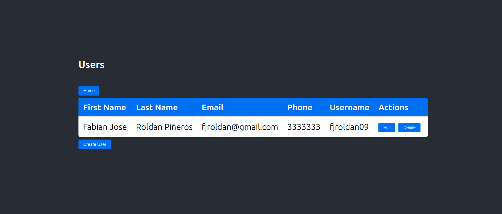
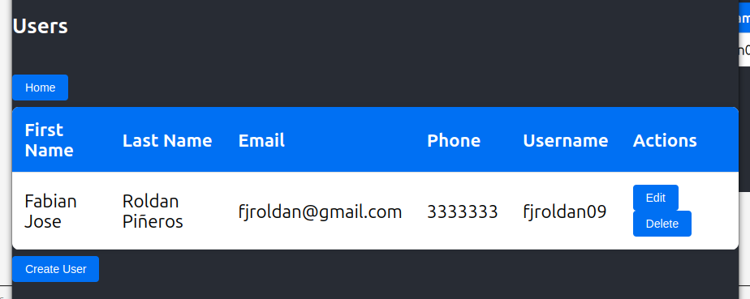

## Descripción del Entregable

A continuación, se abordan diferentes caracteristicas del entregable.

### Interfaz de Usuario Responsiva

[Nota: corresponde al punto 15]

A continuación, se ilustra dos ejemlos de como se adapata la vista de usaurios:



Se puede apreciar el ajuste:



### Implementación de Pruebas Unitarias

[Nota: corresponde al punto 14]

El siguiente codigo ilustra la implementación de pruebas unitarias de un componente en React:

```
// File: userService.test.js
// Description: Test cases for user service.

// Import the necessary functions
import axios from 'axios';
import MockAdapter from 'axios-mock-adapter';
import { fetchUsers, deleteUser } from './userService';
import User from '../dtos/user';

// Create a mock adapter instance
const mock = new MockAdapter(axios);

// Access environment variable
const API_BASE_URL = process.env.NEXT_PUBLIC_API_BASE_URL;

// Test cases
describe('User Service', () => {
  
  afterEach(() => {
    // Reset the mock after each test
    mock.reset();
  });

  test('fetchUsers should return user data', async () => {
    // Mock the API response
    const mockUsers = [
      { id: 1, firstName: 'John', lastName: 'Doe', email: 'john.doe@example.com', phone: '1234567890', username: 'johndoe' },
      { id: 2, firstName: 'Jane', lastName: 'Doe', email: 'jane.doe@example.com', phone: '0987654321', username: 'janedoe' }
    ];
    mock.onGet(`${API_BASE_URL}/api/users`).reply(200, mockUsers);
    const users = await fetchUsers();
    // Check if the response is correct
    expect(users).toEqual([
      new User(1, 'John', 'Doe', 'john.doe@example.com', '1234567890', 'johndoe'),
      new User(2, 'Jane', 'Doe', 'jane.doe@example.com', '0987654321', 'janedoe')
    ]);
  });

  test('deleteUser should delete a user and return response', async () => {
    // Mock the API response
    const userId = '1';
    mock.onDelete(`${API_BASE_URL}/api/users/${userId}`).reply(200, { message: 'User deleted' });
    const response = await deleteUser(userId);
    // Check if the response is correct
    expect(response).toEqual({ message: 'User deleted' });
  });

});
```

### Integración con una API REST

[Nota: corresponde al punto 13 y 5]

Los microservicios implementados estan con el marco REST-FULL de springboot, a continuación se muestra un extracto de codido de la integración:

```
// File: userService.js
// Description: This file contains the code for the get-users page.

// Import necessary modules
import axios from 'axios';
import User from '../dtos/user';

// Access environment variable
const API_BASE_URL = process.env.REACT_APP_API_BASE_URL;

// FetchUsers function
export const fetchUsers = async () => {
  try {
    const response = await axios.get(`${API_BASE_URL}/api/users`);
    return response.data.map(user => new User(
      user.id,
      user.firstName,
      user.lastName,
      user.email,
      user.phone,
      user.username
    ));
  } catch (error) {
    console.error('Error fetching users:', error);
    throw error;
  }
};

// DeleteUser function
export const deleteUser = async (userId) => {
    try {
        const response = await axios.delete(`${API_BASE_URL}/api/users/${userId}`);
        return response.data;
    } catch (error) {
        console.error('Error deleting user:', error);
        throw error;
    }
};
```


### Optimización de Aplicaciones

[Nota: corresponde al punto 9]

He usado la optimización de imágenesdado que es crucial para mejorar el rendimiento y la experiencia del usuario al reducir el tiempo de carga de la página. Esta estrategia implica varias técnicas clave: primero, es fundamental elegir el formato adecuado para cada tipo de imagen, utilizando JPEG para fotos, PNG para imágenes con transparencias, y WebP o AVIF para una compresión más eficiente. Además, se deben aplicar técnicas de compresión sin pérdida o con pérdida para reducir el tamaño del archivo sin comprometer significativamente la calidad visual. El uso de imágenes responsivas, adaptadas a diferentes resoluciones y tamaños de pantalla mediante atributos como `srcset` y `sizes`, asegura que los dispositivos carguen versiones de imágenes adecuadas a sus capacidades. La implementación de técnicas de carga diferida (lazy loading) permite que las imágenes fuera de la vista del usuario se carguen solo cuando sean necesarias, lo que optimiza aún más el tiempo de carga inicial. Además, el uso de herramientas automatizadas y procesos de build, como la optimización de imágenes durante el proceso de construcción con herramientas como `imagemin`, puede facilitar la integración de la optimización en el flujo de trabajo del desarrollo. Finalmente, la implementación de un sistema de almacenamiento en caché adecuado y la utilización de redes de entrega de contenido (CDN) ayudan a distribuir las imágenes de manera eficiente y rápida a través de diferentes ubicaciones geográficas, minimizando los tiempos de respuesta y mejorando la experiencia general del usuario.

### Principios SOLID

[Nota: corresponde al punto 6]

Estos principios son fundamentales para el diseño de software orientado a objetos y ayudan a crear sistemas que sean fáciles de mantener y extender.

1. **Principio de Responsabilidad Única (SRP)**

El **Principio de Responsabilidad Única** sostiene que una clase debe tener una, y solo una, razón para cambiar. Esto significa que cada clase debe encargarse de una única responsabilidad o función dentro del sistema. Si una clase tiene múltiples responsabilidades, puede volverse difícil de entender y de mantener, ya que cualquier cambio en una responsabilidad puede afectar a las otras.

Por ejemplo, considera una clase `Empleado` que maneja tanto los detalles del empleado como la generación de reportes de su desempeño. Si decidimos cambiar la forma en que se generan los reportes, también debemos modificar la clase `Empleado`, aunque la funcionalidad del empleado en sí no haya cambiado. Para aplicar el SRP, debemos separar la generación de reportes en una clase diferente, como `GeneradorDeReportes`, permitiendo que `Empleado` maneje exclusivamente los detalles del empleado.

2. **Principio de Abierto/Cerrado (OCP)**

El **Principio de Abierto/Cerrado** establece que las entidades de software (como clases, módulos y funciones) deben estar abiertas para la extensión pero cerradas para la modificación. Esto significa que debemos poder agregar nueva funcionalidad a un sistema sin cambiar el código existente, minimizando el riesgo de introducir errores en el código que ya funciona.

Para implementar el OCP, a menudo utilizamos la herencia y la interfaz. Por ejemplo, si tenemos una clase `Factura` que realiza cálculos para diferentes tipos de impuestos, podemos definir una interfaz `CalculadorDeImpuestos` con un método `calcular()`. Luego, creamos clases concretas que implementan esta interfaz para diferentes tipos de impuestos. La clase `Factura` puede usar esta interfaz para calcular impuestos sin saber exactamente qué tipo de calculador se está utilizando, permitiendo agregar nuevos tipos de impuestos sin modificar la clase `Factura`.

3. **Principio de Sustitución de Liskov (LSP)**

El **Principio de Sustitución de Liskov** establece que los objetos de una clase derivada deben poder sustituir a los objetos de la clase base sin alterar el funcionamiento del programa. En otras palabras, una clase derivada debe ser sustituible por su clase base sin causar errores o comportamientos inesperados.

Para seguir el LSP, una clase derivada debe extender la funcionalidad de la clase base sin cambiar su comportamiento esperado. Por ejemplo, si tenemos una clase `Vehículo` con un método `mover()`, y una clase derivada `Bicicleta` que sobrescribe `mover()`, `Bicicleta` debe comportarse de manera que no rompa las expectativas establecidas por la clase `Vehículo`. Si la clase `Bicicleta` introdujera un comportamiento inesperado o no implementara correctamente el método `mover()`, violaría el LSP.

4. **Principio de Segregación de Interfaces (ISP)**

El **Principio de Segregación de Interfaces** sostiene que es mejor tener varias interfaces específicas en lugar de una interfaz general. Este principio asegura que las clases no se vean obligadas a implementar métodos que no utilizan, lo que facilita el mantenimiento y evita la implementación de métodos innecesarios.

Por ejemplo, si tenemos una interfaz `Imprimible` con métodos como `imprimir()`, `escanear()`, y `fax()`, y una clase `Impresora` que solo necesita implementar `imprimir()`, pero no `escanear()` o `fax()`, `Impresora` estaría obligada a implementar métodos que no necesita, violando el ISP. En su lugar, deberíamos dividir `Imprimible` en interfaces más específicas, como `Impresora` con el método `imprimir()`, `Escaner` con el método `escanear()`, y así sucesivamente.

5. **Principio de Inversión de Dependencias (DIP)**

El **Principio de Inversión de Dependencias** establece que las dependencias deben ser sobre abstracciones (interfaces o clases abstractas) y no sobre implementaciones concretas. Además, las abstracciones no deben depender de los detalles, sino que los detalles deben depender de las abstracciones. Esto facilita la flexibilidad y la reutilización del código al desacoplar las clases de sus dependencias concretas.

Por ejemplo, si una clase `Controlador` depende directamente de una clase concreta `ServicioDeDatos`, cualquier cambio en `ServicioDeDatos` afectará a `Controlador`. Para aplicar el DIP, podemos definir una interfaz `Servicio` que `ServicioDeDatos` implementa, y `Controlador` dependerá de la interfaz `Servicio`, no de la implementación concreta. Esto permite cambiar la implementación concreta de `Servicio` sin modificar `Controlador`, siempre y cuando la nueva implementación cumpla con la interfaz `Servicio`.


### Administrador de Versiones GIT

[Nota: corresponde al punto 4]

Resolver conflictos de fusión en un repositorio Git es una parte crucial del proceso de integración de cambios en proyectos colaborativos. Aquí se detalla un ejercicio práctico para gestionar estos conflictos:

1. **Identificar el Conflicto** : Los conflictos de fusión ocurren cuando Git no puede reconciliar las diferencias entre dos ramas. Esto generalmente sucede al intentar fusionar una rama (como `feature-branch`) con otra (como `main`). Git marcará los archivos conflictivos y detendrá el proceso de fusión.
2. **Verificar los Conflictos** : Después de ejecutar `git merge feature-branch` en la rama `main`, usa `git status` para identificar los archivos en conflicto. Git indicará estos archivos con un mensaje como “unmerged paths”.
3. **Resolver los Conflictos Manualmente** :

* Abre los archivos conflictivos en un editor de texto. Git insertará marcadores de conflicto (`<<<<<<<`, `=======`, `>>>>>>>`) para mostrar las diferencias entre las versiones en conflicto.
* Examina las secciones delimitadas por los marcadores. El contenido entre `<<<<<<< HEAD` y `=======` representa la versión de la rama actual (`main`), mientras que el contenido entre `=======` y `>>>>>>> feature-branch` representa la versión de la rama fusionada (`feature-branch`).
* Edita el archivo para integrar los cambios de manera adecuada, eliminando los marcadores de conflicto y asegurándote de que el archivo final tenga el contenido correcto.

1. **Marcar el Conflicto como Resuelto** :

* Una vez que hayas resuelto todos los conflictos, guarda los archivos modificados y utiliza `git add <archivo>` para marcar los archivos como resueltos.
* Completa la fusión con `git commit`, que crea un nuevo commit de fusión.

1. **Verificar y Probar** :

* Revisa el estado del repositorio con `git log` y asegúrate de que todos los cambios estén como se esperaba.
* Ejecuta pruebas para confirmar que la integración de cambios no ha introducido errores.

Este proceso asegura que las integraciones sean limpias y que el código base se mantenga funcional y coherente.


### Metodologías Ágiles

[Nota: corresponde al punto 3]

Aplicar los principios ágiles en un proyecto front-end implica enfocarse en la flexibilidad, la colaboración y la entrega continua de valor. Primero, es crucial establecer una comunicación abierta y continua entre el equipo de desarrollo y los stakeholders para asegurar que los requisitos estén claros y puedan adaptarse a medida que el proyecto avanza. En un proyecto front-end, esto podría significar realizar reuniones diarias de seguimiento (scrum) para revisar el progreso y ajustar las prioridades según las necesidades emergentes del cliente. Por ejemplo, supongamos que estamos desarrollando una aplicación web de gestión de tareas. En lugar de planificar todo el proyecto desde el inicio, podríamos dividirlo en sprints de dos semanas, cada uno enfocándose en una funcionalidad específica, como la vista de tareas, la gestión de usuarios o la generación de informes. Al final de cada sprint, se realizaría una revisión con los stakeholders para mostrar el progreso y obtener retroalimentación. Esta retroalimentación se utilizaría para ajustar el backlog del producto y priorizar las tareas del siguiente sprint. Además, se fomentaría la integración continua, asegurando que cada nuevo componente o función se pruebe y se despliegue de manera rápida y frecuente, lo que permite detectar y resolver problemas más rápidamente. La aplicación de estos principios ágiles permite no solo adaptar el proyecto a los cambios y nuevas demandas, sino también asegurar una mayor satisfacción del usuario final, al entregar incrementos funcionales de manera regular y continua.

### Atributos de Calidad

[Nota: corresponde al punto 1]

Los atributos de calidad de software más importantes incluyen funcionalidad, usabilidad, fiabilidad, eficiencia, mantenibilidad y portabilidad. Para asegurar estos atributos en un proyecto front-end, es esencial implementar una serie de prácticas y herramientas específicas. La funcionalidad se garantiza mediante pruebas exhaustivas que validen que la aplicación cumple con los requisitos y expectativas del usuario, utilizando tanto pruebas automatizadas como manuales. La usabilidad se mejora mediante una interfaz intuitiva y una experiencia de usuario optimizada, validada a través de pruebas de usabilidad y retroalimentación de usuarios. La fiabilidad se asegura mediante la implementación de código robusto y manejo adecuado de errores, complementado con pruebas unitarias y de integración para detectar y corregir problemas antes de la implementación. La eficiencia se mantiene mediante la optimización del rendimiento, lo que incluye la minimización de recursos, la carga rápida de páginas y una buena gestión del estado y las solicitudes. La mantenibilidad se facilita mediante un código limpio, bien documentado y modular, siguiendo las mejores prácticas de desarrollo y patrones de diseño. Finalmente, la portabilidad se asegura al seguir estándares web y utilizar técnicas que permitan que la aplicación funcione correctamente en diferentes navegadores y dispositivos. Implementar herramientas de linters, revisar el código de manera regular, y mantener una documentación detallada son prácticas clave para mantener estos atributos en un proyecto front-end.
