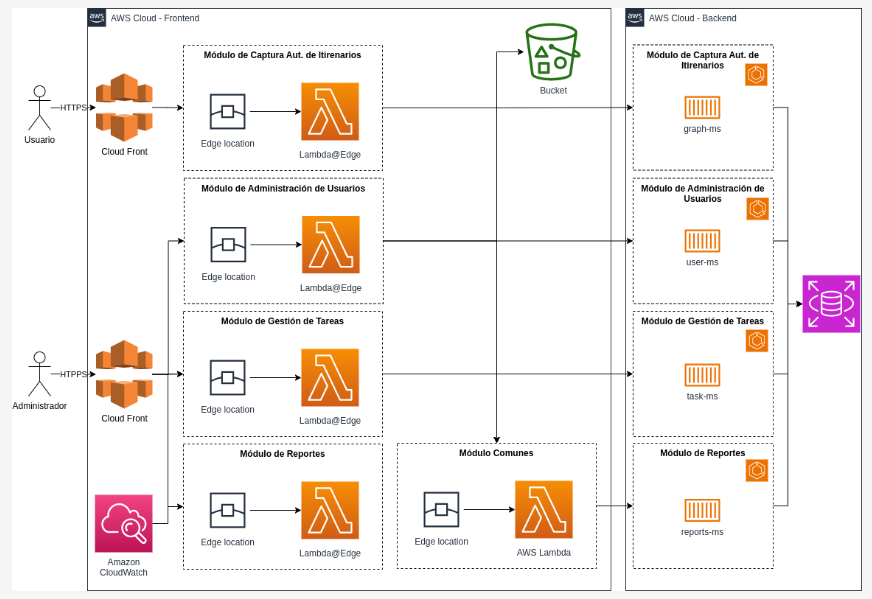
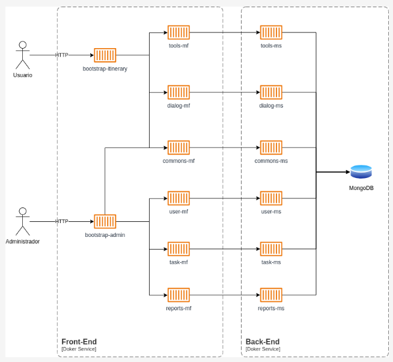

### Diseño & Planeación

El diseño de microfrontends y microservicios siguiendo el enfoque de Domain-Driven Design (DDD) implica descomponer un sistema complejo en partes más manejables y autónomas, alineadas con los dominios de negocio. A través de este enfoque, llegamos a identificar los microfrontends y microservicios.

#### Diseño

[Nota: corresponde al punto 18 y 5]

A continuación, se describe el proceso de diseño adelantado:

1. **Identificación de Bounded Contexts**

El primer paso en DDD es identificar los "Bounded Contexts", que son límites dentro de los cuales un dominio específico del negocio opera de manera coherente. Estos contextos están alineados con los subdominios del negocio y sirven para estructurar el sistema en módulos independientes. En este caso, los dominios principales identificados son  **Usuarios** , **Tareas** y  **Reportes** .

2. **División en Microfrontends**

Cada Bounded Context se traduce en funcionalidades específicas que requieren interfaces de usuario dedicadas. Siguiendo la filosofía de microfrontends, dividimos la interfaz en partes independientes que se encargan de aspectos específicos del dominio.

Por ejemplo:

* **Usuarios** : Tiene dos aspectos principales: la visualización de usuarios y la edición de usuarios. Esto se traduce en dos microfrontends: `get-users-mf-svc` y `edit-users-mf-svc`.
* **Tareas** : Similarmente, las tareas se dividen en la visualización y la edición, resultando en `get-tasks-mf-svc` y `edit-tasks-mf-svc`.
* **Reportes** : De la misma forma, los reportes se gestionan a través de `get-reports-mf-svc` y `edit-reports-mf-svc`.

Esta división asegura que cada microfrontend maneja una funcionalidad específica del negocio y puede ser desarrollado, desplegado y mantenido de forma independiente.

3. **Modelado de Microservicios**

Siguiendo con DDD, una vez que hemos definido los Bounded Contexts, el siguiente paso es modelar los microservicios que soportan la lógica de negocio detrás de cada contexto. Estos microservicios son responsables de implementar las reglas del negocio, y están diseñados para ser escalables y autónomos.

* **Usuarios** : El microservicio `users-ms-svc` maneja toda la lógica relacionada con la gestión de usuarios, como crear, leer, actualizar y eliminar usuarios.
* **Tareas** : `tasks-ms-svc` se encarga de las operaciones relacionadas con la gestión de tareas, aplicando las reglas del negocio para crear, modificar y eliminar tareas.
* **Reportes** : `reports-ms-svc` se ocupa de las operaciones de negocio relacionadas con los reportes, gestionando su creación, edición y consulta.

4. **Interacción entre Microfrontends y Microservicios**

Cada microfrontend está diseñado para interactuar con su correspondiente microservicio. Por ejemplo, `get-users-mf-svc` interactúa con `users-ms-svc` para obtener la lista de usuarios, mientras que `edit-users-mf-svc` envía solicitudes al mismo servicio para actualizar los datos de un usuario.

5. **Servicio de Base de Datos (db-svc)**

El servicio `db-svc` proporciona una abstracción de la base de datos y es accedido por los microservicios para persistir los datos. Aunque es un componente común, sigue la idea de ser desacoplado, permitiendo la evolución independiente de la capa de datos y las capas de negocio.

6. **Ventajas del Enfoque DDD**

Este enfoque garantiza que cada microfrontend y microservicio esté alineado con un contexto de negocio específico, lo que facilita el mantenimiento y escalabilidad del sistema. Los equipos pueden trabajar en paralelo en diferentes partes del sistema sin interferir entre sí, y los cambios en un microfrontend o microservicio no afectan a los demás.

Al utilizar DDD, se ha creado un sistema modular, flexible y alineado con las necesidades del negocio, donde cada componente tiene una responsabilidad clara y está aislado dentro de su propio contexto, asegurando coherencia y autonomía en el desarrollo del sistema.

#### Planeación

[Nota: corresponde al punto 8]

Este plan está diseñado para ser ejecutado en paralelo, permitiendo que diferentes equipos trabajen simultáneamente en distintas partes del sistema.

**Fase 1: Preparación y Configuración del Entorno (4 horas)**

1. **Configuración del entorno de desarrollo común:**
   * Configurar repositorio de código para microfrontends y microservicios.
   * Configurar herramientas de CI/CD (Integración continua/Despliegue continuo).
   * Configurar base de datos inicial y servicio `db-svc`.
2. **Definir estándares de desarrollo:**
   * Establecer convenciones de nombres y estructuras de carpetas.
   * Configurar linters y herramientas de calidad de código.
   * Documentar el flujo de trabajo de desarrollo.

**Fase 2: Desarrollo de Microfrontends (12 horas)**

Para cada microfrontend, el proceso sigue un flujo similar:

1. **Desarrollo de `get-users-mf-svc` (2 horas)**
   * Crear la estructura básica del microfrontend.
   * Implementar componentes para visualizar la lista de usuarios.
   * Configurar la conexión con el microservicio `users-ms-svc` para obtener datos.
   * Realizar pruebas unitarias y de integración.
2. **Desarrollo de `edit-users-mf-svc` (2 horas)**
   * Crear el formulario de edición de usuarios.
   * Implementar lógica para capturar y enviar datos al microservicio `users-ms-svc`.
   * Asegurar la validación de los datos.
   * Realizar pruebas unitarias y de integración.
3. **Desarrollo de `get-tasks-mf-svc` (2 horas)**
   * Desarrollar la interfaz para visualizar la lista de tareas.
   * Configurar la comunicación con el microservicio `tasks-ms-svc`.
   * Implementar pruebas para asegurar la funcionalidad.
4. **Desarrollo de `edit-tasks-mf-svc` (2 horas)**
   * Crear la estructura y lógica para la edición de tareas.
   * Implementar la comunicación con `tasks-ms-svc` para actualizar tareas.
   * Validar y probar la funcionalidad.
5. **Desarrollo de `get-reports-mf-svc` (2 horas)**
   * Implementar la visualización de reportes.
   * Integrar la obtención de datos desde `reports-ms-svc`.
   * Asegurar la correcta renderización de la información.
6. **Desarrollo de `edit-reports-mf-svc` (2 horas)**
   * Crear la interfaz y lógica para la edición de reportes.
   * Conectar con el microservicio `reports-ms-svc` para actualizar datos.
   * Realizar pruebas de validación y aseguramiento de calidad.

**Fase 3: Desarrollo de Microservicios (3 horas)**

Cada microservicio se desarrollará siguiendo un patrón similar:

1. **Desarrollo de `users-ms-svc` (1 hora)**
   * Configurar la base del microservicio.
   * Implementar las rutas CRUD para usuarios.
   * Probar y documentar las funcionalidades.
2. **Desarrollo de `tasks-ms-svc` (1 hora)**
   * Crear el microservicio con operaciones CRUD para tareas.
   * Asegurar la conexión con la base de datos y probar las operaciones.
   * Documentar el uso y pruebas.
3. **Desarrollo de `reports-ms-svc` (1 hora)**
   * Implementar las rutas y lógica para la gestión de reportes.
   * Configurar las operaciones de persistencia en la base de datos.
   * Validar la funcionalidad con pruebas unitarias.

**Fase 4: Integración y Pruebas (4 horas)**

1. **Integración de microfrontends con microservicios (2 horas)**
   * Realizar pruebas end-to-end para asegurar que los microfrontends se comunican correctamente con los microservicios.
   * Resolver cualquier problema de integración que surja.
2. **Pruebas de usuario y feedback (2 horas)**
   * Implementar pruebas de aceptación con usuarios finales o stakeholders.
   * Recoger y priorizar feedback para posibles mejoras.

**Fase 5: Despliegue y Monitoreo (2 horas)**

1. **Despliegue de microfrontends y microservicios (1 hora)**
   * Desplegar todos los componentes en el entorno de producción.
   * Configurar herramientas de monitoreo y logging.
2. **Monitoreo y ajustes finales (1 hora)**
   * Monitorear el sistema en producción para asegurar estabilidad.
   * Realizar ajustes finales basados en el comportamiento en producción.

**Total de Tiempo Estimado: 25 horas**

Este plan permite un desarrollo eficiente y estructurado, asegurando que cada componente esté bien aislado y sea fácilmente mantenible, al mismo tiempo que asegura una integración fluida entre las diferentes partes del sistema.

### Arquitectura Objetivo

A continuación, se presenta una arquitectura ideal:



### Arquitectura de Demostración

[Nota: corresponde a los puntos 2]

En la siguiente imagen se aprecia la arquitectura del demo:



Para efectos de la demostración, se implementaron los siguientes servicios:

* **shell-mf-svc**: Contenedor principal (shell) que carga dinámicamente los microfrontends. (Implementando en React, [Nota: corresponde a los puntos 19 y 20])
* **edit-users-mf-svc**: Servicio microfrontend encargado de gestionar la edición de usuarios. Permite modificar detalles de los usuarios a través de una interfaz específica dentro de la aplicación. (Implementando en Angular, [Nota: corresponde al punto 20]).
* **get-users-mf-svc**: Servicio microfrontend encargado de obtener y mostrar la lista de usuarios. Proporciona una interfaz para visualizar y posiblemente interactuar con los datos de los usuarios. (Implementando en React, [Nota: corresponde al punto 20])
* **edit-reports-mf-svc**: Servicio microfrontend encargado de la edición de reportes. Permite modificar los reportes existentes, gestionando la interfaz necesaria para editar la información del reporte. (Implementando en Angular, [Nota: corresponde al punto 20])
* **get-reports-mf-svc**: Servicio microfrontend que obtiene y muestra los reportes disponibles. Proporciona una interfaz para visualizar y posiblemente analizar los datos de los reportes. (Implementando en React, [Nota: corresponde al punto 20])
* **edit-tasks-mf-svc**: Servicio microfrontend encargado de la edición de tareas. Facilita la modificación de detalles de las tareas a través de una interfaz específica dentro de la aplicación. (Implementando en Angular, [Nota: corresponde al punto 20])
* **get-tasks-mf-svc**: Servicio microfrontend encargado de obtener y mostrar la lista de tareas. Proporciona una interfaz para visualizar las tareas y posiblemente interactuar con ellas. (Implementando en React, [Nota: corresponde al punto 20])
* **reports-ms-svc**: Microservicio que maneja la lógica de negocio y las operaciones relacionadas con los reportes. Este servicio se encarga de crear, leer, actualizar y eliminar reportes en el backend. (Implementando en Sprintboot, [Nota: corresponde al punto 20])
* **users-ms-svc** : Microservicio dedicado a gestionar la lógica de negocio y las operaciones relacionadas con los usuarios. Se encarga de las operaciones CRUD (Crear, Leer, Actualizar, Eliminar) sobre los datos de los usuarios. (Implementando en Sprintboot, [Nota: corresponde al punto 20])
* **tasks-ms-svc**: Microservicio que maneja la lógica de negocio y las operaciones relacionadas con las tareas. Se encarga de gestionar las tareas en el backend, incluyendo su creación, modificación y eliminación. (Implementando en Sprintboot, [Nota: corresponde al punto 20])
* **db-svc**: Servicio de base de datos que se encarga del almacenamiento y la gestión de datos persistentes para los microservicios. Este servicio proporciona una capa de acceso a la base de datos para los demás microservicios, garantizando la integridad y disponibilidad de los datos. (Implementando en Postgres, [Nota: corresponde al punto 20])

[Nota: corresponde al punto 10]

Docker se utilizó para el despliegue de los servicios debido a sus numerosas ventajas en la gestión y operación de aplicaciones distribuidas.

1. **Aislamiento de Entornos** : Docker permite empaquetar cada microservicio junto con todas sus dependencias y configuraciones en un contenedor aislado. Esto garantiza que cada servicio se ejecute en un entorno consistente, sin interferencias entre sí, y minimiza los problemas de compatibilidad en diferentes entornos (desarrollo, pruebas, producción).
2. **Consistencia y Reproducibilidad** : Al utilizar Docker, se asegura que los servicios se ejecuten de la misma manera en cualquier entorno. Esto es crucial en un sistema con múltiples microservicios y microfrontends, ya que elimina las diferencias entre los entornos de desarrollo y producción, y reduce errores causados por configuraciones no coincidentes.
3. **Escalabilidad y Flexibilidad** : Docker facilita la escalabilidad horizontal, permitiendo desplegar múltiples instancias de un microservicio en diferentes contenedores, que pueden ser gestionados y escalados automáticamente por orquestadores como Kubernetes. Esto es esencial en aplicaciones que requieren alta disponibilidad y escalabilidad dinámica.
4. **Portabilidad** : Los contenedores Docker son altamente portátiles y pueden ejecutarse en cualquier sistema que soporte Docker, sin necesidad de configurar el entorno manualmente. Esto facilita el despliegue en diferentes plataformas, ya sea en servidores locales, nubes públicas o privadas.
5. **Despliegue Rápido y Eficiente** : Docker permite el despliegue rápido de aplicaciones mediante imágenes preconstruidas, lo que reduce significativamente el tiempo necesario para lanzar nuevas versiones de los servicios o restaurar servicios en caso de fallas.

En resumen, Docker se utilizó para el despliegue de los servicios por su capacidad de proporcionar entornos aislados, consistentes y portátiles, que facilitan la gestión, escalabilidad y confiabilidad de los microservicios y microfrontends en el sistema.

### Manejo de Errores

[Nota: corresponde al punto 16]

A continuación se ilustra un extracto del código fuente respecto al esquema de manejo de errores implementado:

```
export class UserService {

  // Base URL for the API.
  private baseUrl = `${environment.apiUrl}/api/users`;

  // Constructor.
  constructor(private http: HttpClient) { }

  // Method to get a user by ID.
  getUser(id: number): Observable<User> {
    return this.http.get<User>(`${this.baseUrl}/${id}`);
  }

  // Method to save a user.
  saveUser(user: User): Observable<User> {
    if (user.id === 0 || user.id === null) {
      user.id = null;
      return this.http.post<User>(this.baseUrl, user).pipe(
        catchError(this.handleError)
      );
    }
    return this.http.put<User>(`${this.baseUrl}/${user.id}`, user).pipe(
      catchError(this.handleError)
    );
  }

  // Method to delete a user.
  private handleError(error: HttpErrorResponse) {
    let errorMessage = 'An unknown error occurred!';
    if (error.error instanceof ErrorEvent) {
      // A client-side or network error occurred
      errorMessage = `Error: ${error.error.message}`;
    } else {
      // The backend returned an unsuccessful response code
      errorMessage = `Error Code: ${error.status}\nMessage: ${error.message}`;
    }
    return throwError(errorMessage);
  }
}
```


El esquema de manejo de errores en la clase `UserService` se implementa mediante el método `handleError`, el cual es utilizado en los métodos que realizan operaciones HTTP, como `saveUser`. En este esquema, cuando una operación HTTP falla, se captura el error utilizando la función `catchError`, que redirige el error al método `handleError` para su procesamiento.

El método `handleError` evalúa el tipo de error ocurrido. Si el error proviene del cliente o de la red (es decir, si es un error del lado del cliente), se identifica mediante `error.error instanceof ErrorEvent` y se asigna un mensaje de error basado en la información proporcionada por el evento de error (`error.error.message`).

Por otro lado, si el error proviene del backend, el código de respuesta HTTP y el mensaje de error son extraídos y formateados para crear un mensaje de error más informativo (`Error Code: ${error.status}\nMessage: ${error.message}`).

Finalmente, el método `handleError` utiliza `throwError` para devolver un observable que contiene el mensaje de error generado. Esto permite que el componente o servicio que llamó al método HTTP maneje el error de manera adecuada, como mostrar un mensaje al usuario o realizar acciones correctivas.

Este esquema de manejo de errores proporciona un enfoque estructurado para capturar y manejar diferentes tipos de errores, mejorando la robustez y la capacidad de respuesta de la aplicación ante fallos inesperados.
